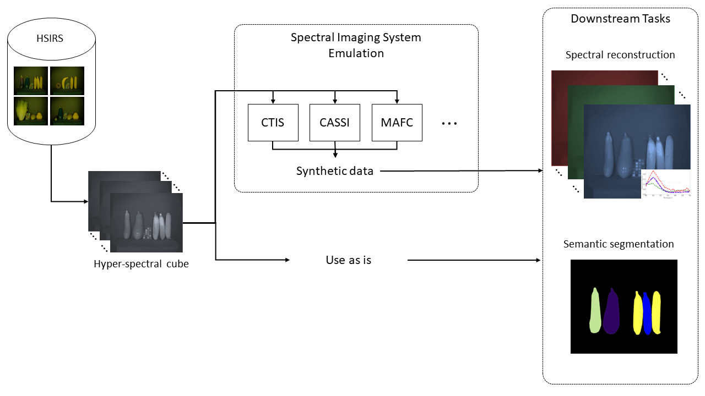
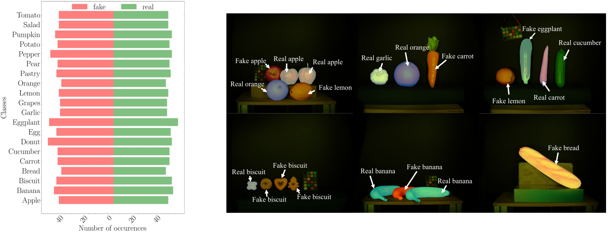

# High-quality Spectral Image Resonstruction and Segmentation Dataset (HSIRS)
# [[Paper](https://github.com/LTTM/HSIRS/edit/main/README.md)] (Coming soon)

## Overview
We introduce HSIRS, a large scale dataset of hyper-spectral images along with corresponding manually annotated segmentation maps for material characterization and classification based on spectral signature. Such data can be used to simulate any type of spectrometer and to train DNNs end-to-end for spectral reconstruction and image segmentation tasks. HSIRS features scenes containing real and fake (made of polyster, plastic or ceramic) food items with different backgrounds and scene layouts, some scnes contain also colorcheckers. 
Spectral bands are sequentially captured using a VariSpec<sup>TM</sup> tunable color filter and the scene is illuminated with 4 Halogen light sources. 


Figure 1: HSIRS can be used as is or to emulate different snapshot spectrometers. 
## HSIRS Stats
| Nbr. of images    | Spatial res. | Spectral range (nm)| Spectral res. / Nbr. bands | Nbr. semantic classes | Illumination |
| :---------------: | :----------: | :----------------: | :------------------------: | :-------------------: | :----------: |
| 592 | 2048x2048 | 470 - 700 | 7 nm / 33 bands | 40 | 4 Hologen lamps 


Figure 2: (Left) Number of fake/real occurences of each food item class. (Right) Sample images in sRGB space with overlaid segmentaion maps. 

## Dataset Structure
In the main `HSIRS/` folder there are 592 sub-folders for each captured scene. Each with a name `scene_name` and within every sub-folder there are 35 files:
- `scene_name_xxx_nm.png`: 8-bit gray scale image for a given spectral band (total of 33 bands).
- `scene_name_rgb.png`: The sRGB image obtained from the hyper-spectral cube using the CIE 1931 conversion norm.
- `scene_name_seg_map.png`: 8-bit gray scale image of the segmentation map.

Each scene name starts with `YYYYMMDDHHMMSS` indicating the year,month,day, and time of capture. 

The segmentation map for each scene contain classes' IDs `[0,1,2,..,40]`, `0` being the ID for the back ground class.

In addition to that, `labels.txt` is a text file containing the names for all the semantic classes present in the dataset

## Download 
A link to download the full data will be available soon.

## Citation
If you use this dataset in your research please cite our work:
```
@article{
  title={Joint Reconstruction and Spatial Super-resolution of Hyper-Spectral CTIS Images via Multi-Scale Refinement},
  author={Mel, Mazen and Gatto, Alexander and Zanuttigh, Pietro},
  year={2024},
}
```
## License
See LICENSE.txt
